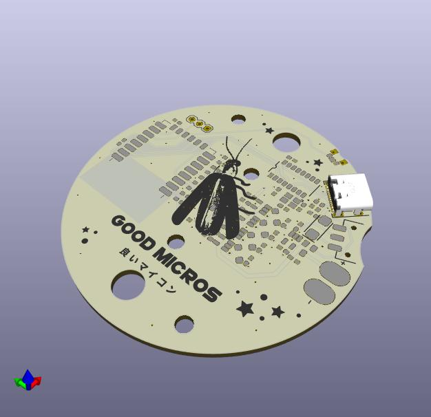

# requirements

* WLED compatible
* battery powered with the possibility to bypass with USB power
* brightness comparable to a strip of ws2812b leds
* programmable without external hardware

# fixme

* battery pack cable seems to be very close to the power switch

# TODO

* gather datasheets to a common location
* update pdf links (ex: esp12)
* battery has no BOM or datasheet
