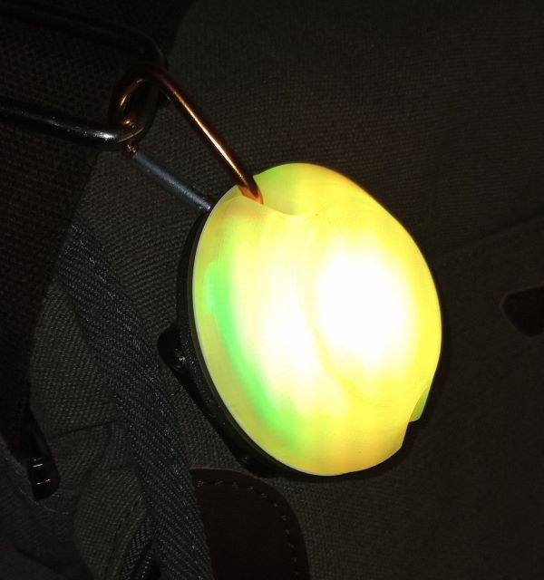

# Hikari
This is an all-in-one, battery powered, single RGBW led module designed to be used with the [WLED project](https://wled.me).
The goal is to provide inexpensive, portable lights for events and DIY use.

## requirements

* WLED compatible
* Battery powered with the possibility to bypass with USB power
* Brightness comparable to a strip of ws2812b leds
* Programmable without external hardware

## Usage
Connect 3x AAA batteries and switch on. Configure the light over WLAN via [LedFX](https://www.ledfx.app/) or [WLED compatibles](https://github.com/Aircoookie/WLED#-supported-light-control-interfaces).
The USB port can be used to bypass the battery pack for extended usage.

## Wireless control  
By default the device is looking for a GoodMicros WLAN and tries to connect to it. 
If it can't find the WLAN it will create an access point which you can connect with your phone or laptop to change the effects and settings.  
The AP name is hikari- + the number of your device which is also printed on a sticker in the battery case. The default password for the AP is wled1234.

### modes  
* The switch turns the whole module on/off
* The button puts the device into sleep
* Two button presses sets the color to white (and disables the live mode)
    * back to normal with a long press
    * reboot the device to enable live mode again
* Hold the button for 6 seconds to reset wlan config
* Hold the button for more than 12 seconds to factory reset wled settings

## Troubleshooting
|issue|cause|solution|
|-----|-----|--------|
|only green works| low battery| replace batteries or connect USB|
|stuck on red| USB connected while powered off| disconnect USB -> switch on -> connect USB|
|stuck on red| button pressed while powering on| power off -> power on without pressing button|

## Configuration
Install WLED via https://install.wled.me/  

The switch should be in the power-on position when programming.
If wled installer doesn't allow you to erase the memory, hold the switch while connecting the power (the light should stay red).  

After successful flashing remove the device and plug it back in to refresh the serial port. After connecting you have the option to connect the device to wlan. If it doesn't appear instantly press one of the options from wled installer and click back to refresh the view.

pin configuration on WLED:
|color|pin|
|-----|---|
| red |16 |
|green|14 |
|blue |12 |
|white|13 |

[Case model](https://cad.onshape.com/documents/9da918a63413a7b839d4e473/w/a43791fa43f813add74c9832/e/dfbc73c4b037cd1ff73a47b7)

## Bugs
* CH340G VCC should be connected to 3.3V
